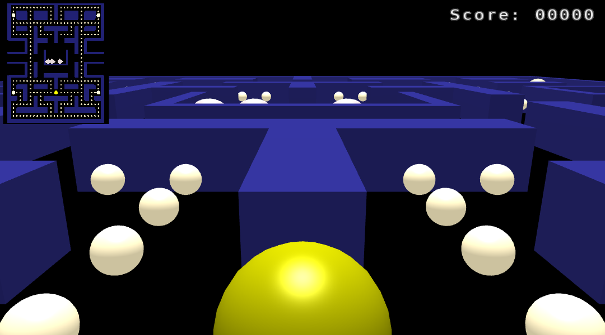
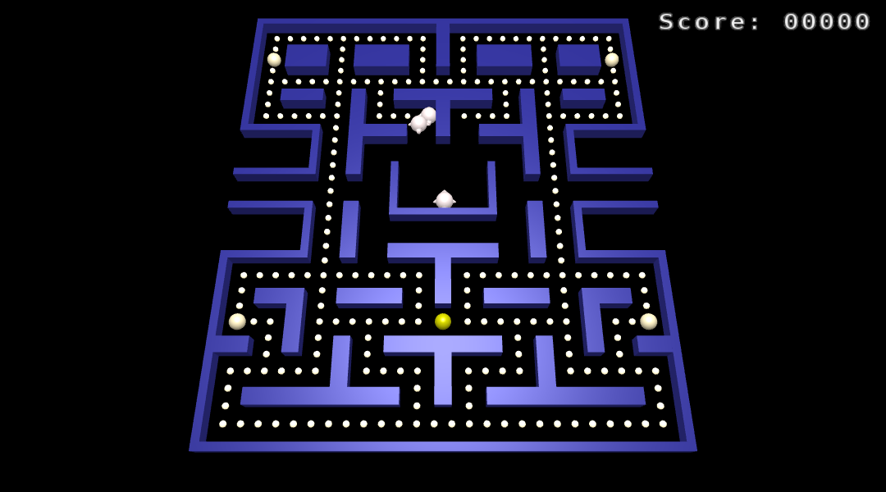

# Pac-Man 3D
Final Project for UCLA's CS 174A
 
 
**Project Members:**  
Jenny Cao  
Ritu Mathews  
Ryan Doan  
Jessica Win  

Enjoy the 1980 classic arcade game from a different perspective, along with new features!  

**<ins>Game Controls</ins>** 
- [u] Change to Forward Direction  
- [k] Change to Right Direction   
- [h] Change to Left Direction  
- [j] Change to Back Direction  
- [m] Stop Movement  
- [c] View Game from Birds Eye POV  

**<ins>Play the Game!</ins>**!

1) Download or clone the repository
2) Run the following files depending on your operating system
   - MAC OS: _host.command_
   - WINDOWS: _host.bat_
3) Go to the following URL: http://localhost:8000/
4) Enjoy!
